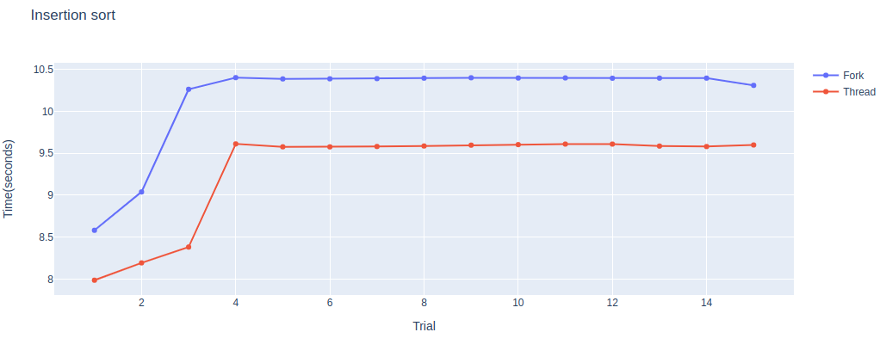

# Comparison between Pthreads and Processes
## Objective
The objective of this project was to compare the two methods of multiprocessing and learn about their advantages and disadvantages.

## Introduction
This project is an attempt to illustrate the difference in performance between **pthreads** and processes created by using the **fork()** system call. To illustrate that, **5 sorting algorithms** are used.

## Background
Before starting this project, these were some facts known to the contributors:

1. Purpose of **fork()** system call is to create a new process for the operating system with a new **Process Id (PID)**.
2. Process created from **fork()** have different address space and the child process get a copy of the address space of parent process.
3. Purpose is to create a new thread in the program which is given the same process of the caller
4. Threads are created within a process and share the resources of that process and therefore of other threads as well. Hence communication between threads is possible through shared memory.

## Platform and Languages
* Platform used for building this project is **Debian** based Linux distribution **(i.e. Ubuntu and Mint)**.
* Language used for this project is **C**.
* For plotting of graphs **Plotly** module for **Python** is used. 

## Methodology

#### **Following is the methodology opted for implementation of this comparison based project:** 

### For Processes
1. A different file was created for every sorting algorithm.
2. In each file a total of **8 process** are created by calling the fork system call 3 times. The time it takes to complete the sorting for all the 8 processes is calculated by using the C standard library function 'clock()' which calculates time using the CPU clock. The time is calculated since the invocation of the first child process and till all the process are returned back to the parent process.
3. 15 Iterations of this process is done to get a good sample for getting an idea about average execution time.
4. The result of all iterations are stored in a CSV file to later use for plotting of graphs.

### For Threads

1. There is one menu driven program for threads based implementation.
2. A similar strategy is used for threads as well by using 8 threads and 15 iterations of that process.
3. Here also, a CSV file gets created for each sorting algorithm for visualization purposes.

## Results

 
 
 
 
 

## Conclusion

By observing the values obtained by executing the programs and then by visualizing the comparison it is concluded that multithreading performs better then multiprocessing generally. However, there exist a pradox of choice to whether choose multithreading or multiprocessing. 
This choice comes down to the use case of the applicatoin or program. if you application has to rely on shared memory and there is not many parts of your program then multi processing is generally a better choice. As it give your program a set of multiple hands to do the job instead of one.
However, if your program has different tasks at hand and they need to work seprately and need to access the resources of the system independently then mutiprocessing should be your choice.

